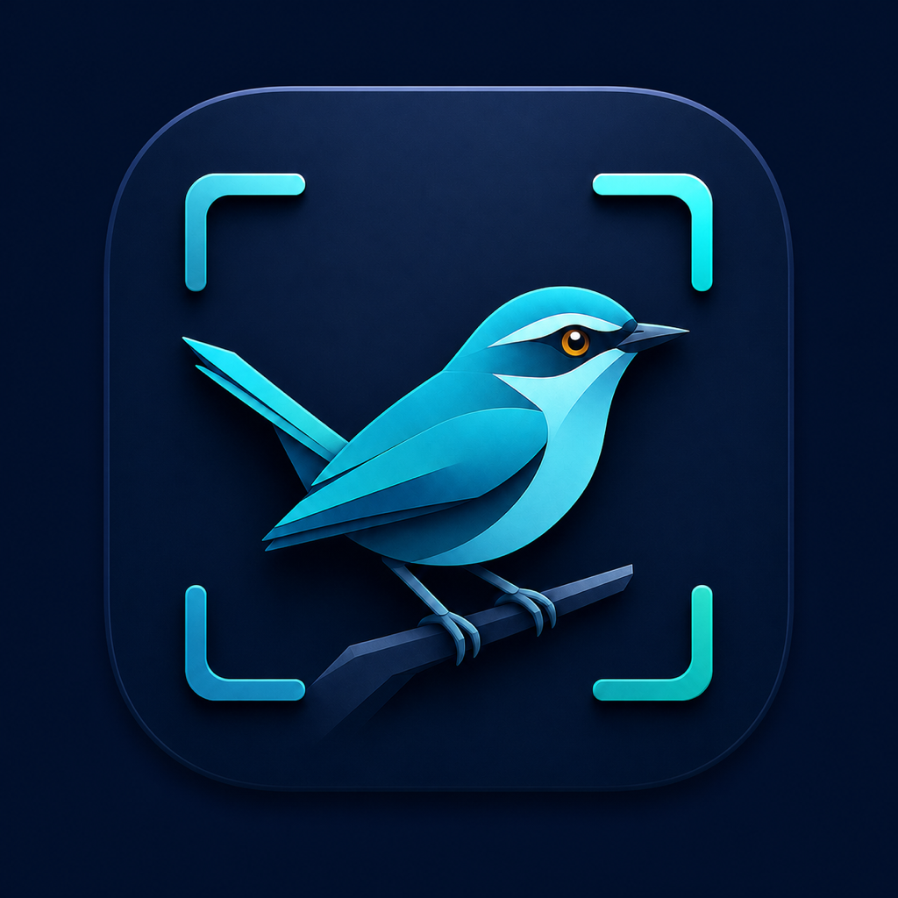
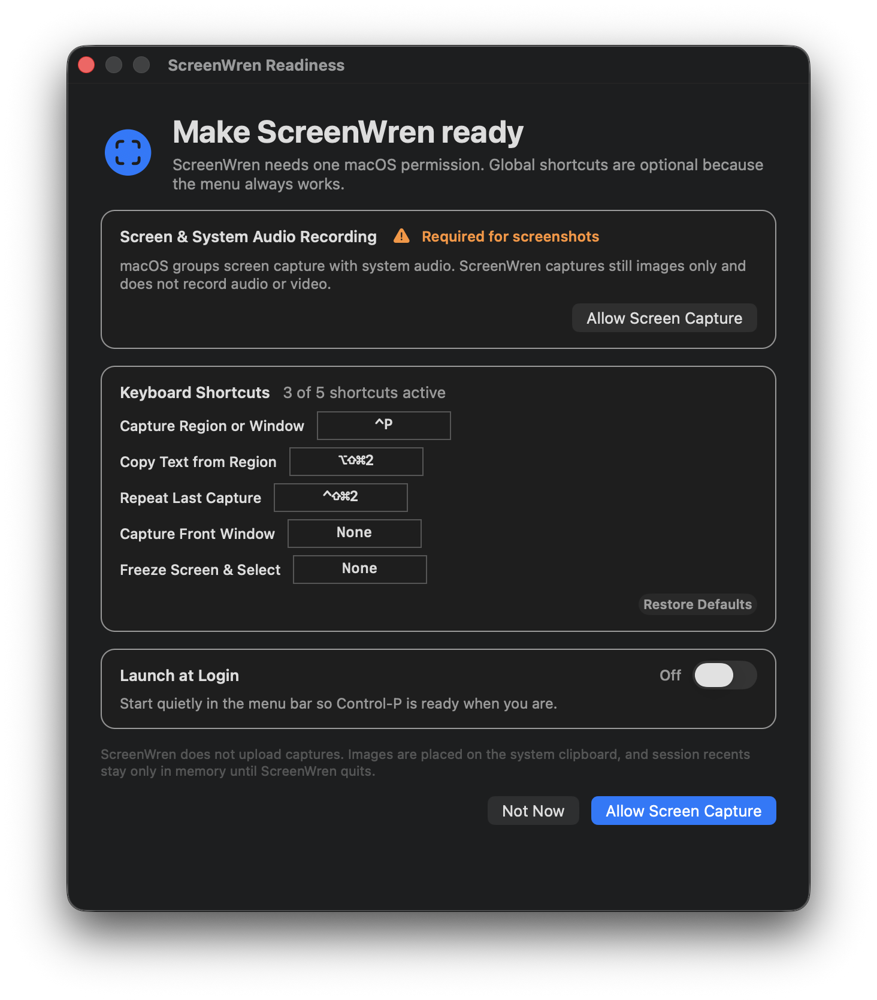

<p align="center">
  
</p>

<h1 align="center">ScreenWren</h1>

<p align="center"><strong>Capture. Copy. Keep moving.</strong></p>

<p align="center">
  A fast, private, native screen-capture loop for macOS 26 and newer.
</p>

<p align="center">
  <a href="https://github.com/diamondplated/screenwren/actions/workflows/ci.yml"></a>
  
  
  <a href="LICENSE"></a>
</p>

<p align="center">
  <a href="#the-fast-path">Quick start</a> ·
  <a href="#what-it-can-do">Features</a> ·
  <a href="#privacy-by-construction">Privacy</a> ·
  <a href="PRIVACY.md">Privacy policy</a> ·
  <a href="SECURITY.md">Security</a> ·
  <a href="CONTRIBUTING.md">Contributing</a> ·
  <a href="DESIGN.md">Design</a>
</p>

---

## The work between seeing something and using it

Press **`⌃P`** from any app. Click a highlighted window or drag an exact region. Release.

It's already on your clipboard, and a native PaperKit editor is open in case you want to mark it up.
That's the loop. It's meant to be over before you've thought about it.

- ⚡ **One keystroke to clipboard.** No save dialog, no file to find, no "where did that go".
- 🔒 **Nothing leaves your Mac.** No account, no cloud library, no analytics, no network service of
  its own. OCR and subject lifting run through Apple's local Vision frameworks.
- 📦 **Zero third-party packages.** Capture, OCR, subject lifting, and editing are all Apple
  frameworks.
- 🧹 **No hidden screenshot library.** Recents live in memory and vanish when ScreenWren quits.
- 🔤 **Text, not just pixels.** Pull copyable text straight out of a region without ever putting an
  image on the clipboard.

<p align="center">
  
</p>

---

## The fast path

1. Press `⌃P` from any app.
2. Click a highlighted window, or drag a region.
3. Paste immediately, or continue in the editor that opens.

While the selector is open:

| Key | Does |
|---|---|
| `Space` | switch between window snapping and region-only selection |
| `Tab` / `⇧Tab` | move through eligible windows |
| `Return` | capture the highlighted window |
| `Esc` | cancel without touching the clipboard |

---

## What it can do

### Capture

- **Windows and regions.** Native ScreenCaptureKit window capture, or an exact drag.
- **Front window, no selector.** Capture the frontmost eligible window immediately.
- **Freeze first.** Freeze the display, then select from the frozen pixels — for menus and hover
  states that vanish the moment you move.
- **Precision tools.** A pixel loupe, live dimensions, and hold-`Space` repositioning.
- **Straight to text.** OCR a region without putting an image on the clipboard at all.
- **Repeat.** Re-run the last valid region or exact window without reopening the selector.
- **Timed.** Three-second delay for menus, tooltips, and hover states.
- **Scrolling capture.** Guided, with conservative seam detection.
- **Session-only recents.** Never a hidden screenshot library.

### Edit and finish

- **Native markup.** Apple PaperKit and PencilKit.
- **Keyboard-first annotation.** Arrow, rectangle, highlighter, text, and numbered steps.
- **Instant Inspect.** Select recognized text directly and act on detected QR/barcodes.
- **Subject lifting.** Local foreground extraction; when several subjects are found, pick one.
- **Redaction.** Opaque rectangular redaction — plus a visual blur that is explicitly labeled
  **not secure**.
- **Geometry.** Crop, aspect-preserving resize, 90° rotation, reset.
- **Pin.** Float a flattened capture above ordinary windows.
- **Finish.** Copy, save as PNG, drag out as PNG, or use the native Share menu — or copy and close
  the editor in one command.

### Default shortcuts

| Action | Shortcut |
| --- | --- |
| Capture a window or region | `⌃P` |
| Copy text from a selected target | `⌥⌘⇧2` |
| Repeat the last valid region or window | `⌃⌘⇧2` |
| Toggle Instant Inspect in the editor | `⇧⌘I` |
| Copy text from the editor | `⇧⌘T` |
| Copy a transparent subject from the editor | `⇧⌘L` |
| Copy the edited image | `⇧⌘C` |
| Copy the edited image and close its editor | `⌘Return` |

Every capture command is also in the menu-bar icon. Open **ScreenWren Readiness…** to change global
shortcuts, see conflicts, restore defaults, and control Launch at Login. Front Window and Freeze
start unassigned, so they don't claim a global key without your say-so.

<details>
<summary><strong>Inspect and canvas keys, in detail</strong></summary><br>

In an editor, **Inspect** exposes native Live Text selection/data detectors and outlines detected
QR/barcodes. `⇧⌘T` copies the exact selection when one is active, or the full recognized text
otherwise. Click a code to open its action menu, then choose **Copy Value** or, for a validated
`http` or `https` value, **Open** in your default app. The same actions are available under
**••• → Detected Codes**. Press `Esc` to return to editing. ScreenWren analyzes the image locally
and does not fetch a detected URL itself.

When an editor canvas is active and you are not typing into a text box, press `A` for an arrow, `R`
for a rectangle, `H` for a yellow highlighter, `T` for text, or `N` for the next numbered step.
`Esc` returns to selection mode. These keys drive the same native PaperKit canvas shown in the
toolbar.
</details>

---

## Privacy by construction

ScreenWren does not upload captures. It has no analytics or advertising SDK and no network service
of its own. OCR and subject lifting run through Apple's local Vision frameworks.

- Captures and pins live in process memory.
- Precision loupe and Freeze may hold one full display frame transiently in memory; only the
  selected region or requested window is delivered.
- Recents are capped at five images and approximately 128 MB, then disappear when ScreenWren quits.
- ScreenWren writes an image file only when you complete Save or a file drag. A Share service may
  send or persist it only after you choose that service.
- Clipboard contents are system-wide and may be read or retained by other apps, clipboard managers,
  or macOS.
- ScreenWren requests Screen Recording access — not Accessibility, not microphone.

The full data boundary is documented in [PRIVACY.md](PRIVACY.md).

---

## Requirements

- macOS 26 or newer.
- Xcode 26 with the macOS 26 SDK to build from source.
- Screen Recording permission to capture pixels.

ScreenWren uses macOS 26's PaperKit APIs and intentionally does not carry a compatibility editor for
older macOS releases.

---

## Build from source

A Swift package with no external package dependencies.

```sh
swift test --parallel
./build-app.sh
open dist/ScreenWren.app
```

The build script creates a Universal 2 `dist/ScreenWren.app` and a versioned ZIP. Local builds are
ad-hoc signed by default. A public distribution build must set `SCREENWREN_SIGNING_IDENTITY` to a
Developer ID Application identity and be notarized.

On first launch, **ScreenWren Readiness** explains the required Screen Recording permission and
shows shortcut status. If capture is still blocked after enabling ScreenWren in **System Settings →
Privacy & Security → Screen & System Audio Recording**, choose **Quit & Reopen ScreenWren** in
Readiness.

<details>
<summary><strong>Verification harness</strong></summary><br>

```sh
./qa.sh
```

Runs tests, rebuilds the app, and verifies the archive, both architectures, property lists, nested
login item, signatures, and executable self-checks. A real pixel capture is opt-in, because macOS
grants Screen Recording permission to an exact signed app in a logged-in user session:

```sh
SCREENWREN_LIVE_QA=1 ./qa.sh
```

For editor work, open any local image without capturing the screen:

```sh
open -n dist/ScreenWren.app --args --open-image /path/to/image.png
```
</details>

See [CONTRIBUTING.md](CONTRIBUTING.md) for the development workflow and [DESIGN.md](DESIGN.md) for
behavioral invariants and acceptance boundaries.

---

## Deliberate limits

ScreenWren is a capture loop, not a document suite:

- Region selection is limited to one display at a time.
- Scrolling is guided and manual; ScreenWren does not control another app or request Accessibility
  access.
- Protected or DRM-restricted content may capture as black.
- OCR and subject detection can fail on ambiguous imagery.
- There is no video/GIF capture, cloud sync, account system, or persistent library.

The source currently identifies as a pre-1.0 build. Behavior and file formats may change before the
first stable release.

---

## License

[MIT](LICENSE).
